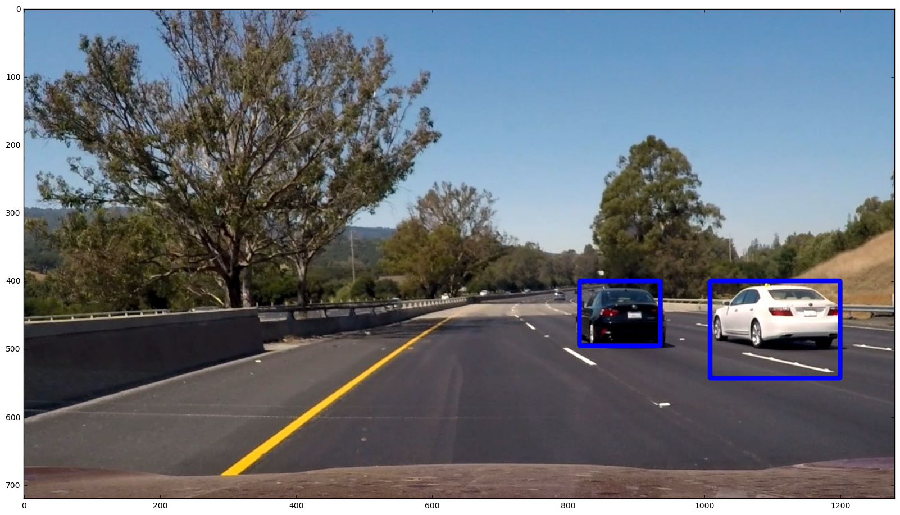
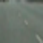
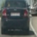
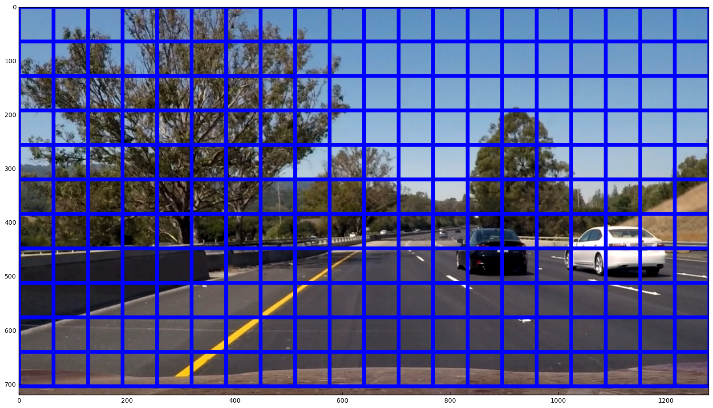
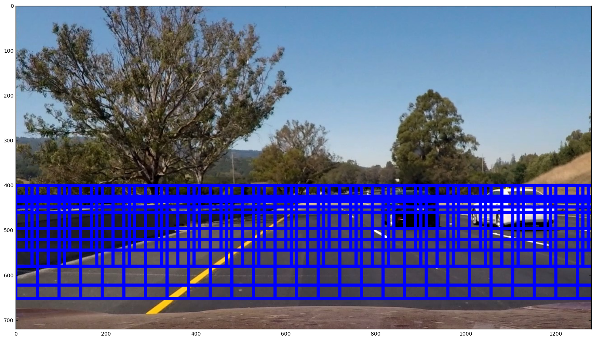
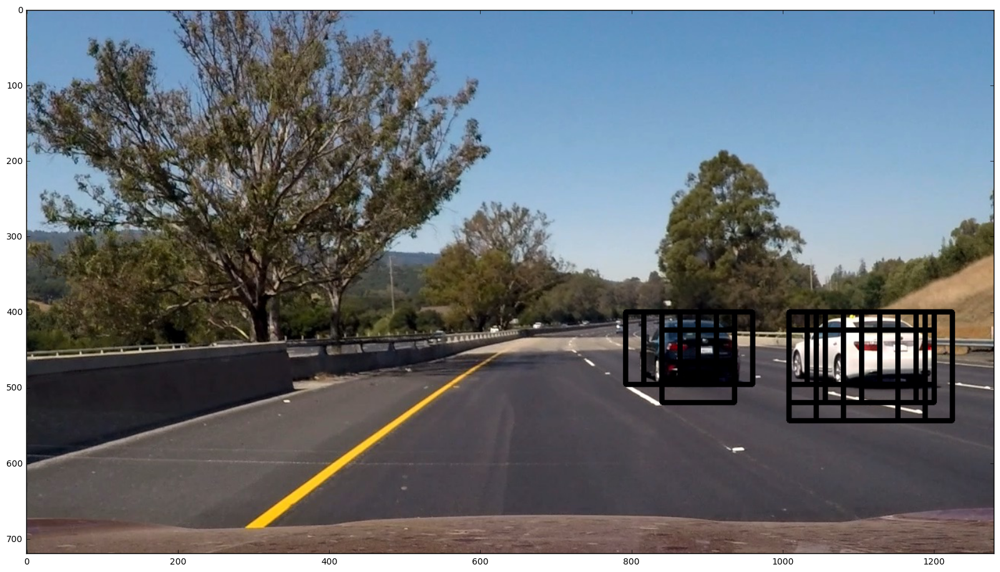
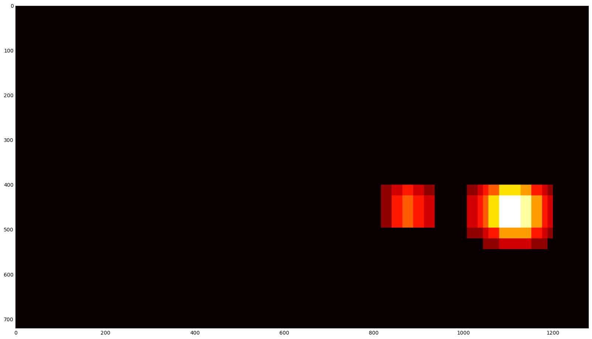

# Vehicle Detection

The goal of this project was to write a software pipeline to detect vehicles in a video. Essentially we wanted to achieve vehicle detection frame by frame, a result looking like this:

The final results can be seen [here](https://youtu.be/3Yg09z7_g9s) or by downloading output.mp4 (this file has been crashing and burning on github since its a larger ~15mb file).

The Project
---

The key files in this project include:

    > EDA.ipynb - Visualization of channel histograms and 3D spatial visualization for just experimentation
    > Classification and train test output.ipynb - Training the classifier and running a test to achieve a fair degree of accuracy, exporting the classifier and features
    > Window search.ipynb - Perform window sliding and classification to determine if a vehicle is detected in a sliding window within a frame. Output the video
    > output.mp4 - Resulting video of the previous 2 Jupyter Notebooks
    > project_video.mp4 - Original video before any draw ons have been made
    > svc.pickle - Pickle file containing the classifier

The goals / steps of this project are the following:

* Perform a Histogram of Oriented Gradients (HOG) feature extraction on a labeled training set of images and train a classifier Linear SVM classifier
* Optionally, you can also apply a color transform and append binned color features, as well as histograms of color, to your HOG feature vector. 
* Note: for those first two steps don't forget to normalize your features and randomize a selection for training and testing.
* Implement a sliding-window technique and use your trained classifier to search for vehicles in images.
* Run your pipeline on a video stream (start with the test_video.mp4 and later implement on full project_video.mp4) and create a heat map of recurring detections frame by frame to reject outliers and follow detected vehicles.
* Estimate a bounding box for vehicles detected.

Breaking down the goals into specific tasks,

    1. Understand the feature space of the cars in the image
    2. Using the right feature extraction techniques, construct a feature matrix for the 64 x 64 images
    3. Extract all the featues and labels, and shuttle and split the data
    4. Train a classifier to detect the car image on each frame with
    5. Narrow down the picture into the useful areas and think about the window size and perspective
    6. Define windows with varying sizes depending on perspective and lay them out in a frame
    7. If a vehicle is detected in any of these frames, mark the frames
    8. Construct a heat map of the windows with vehicles detected, threshold the counts out to filter
    9. Redraw the rectangle around detected windows and apply to video.

The training dataset used for this project can be found here. Datafor [vehicle](https://s3.amazonaws.com/udacity-sdc/Vehicle_Tracking/vehicles.zip) and [non-vehicle](https://s3.amazonaws.com/udacity-sdc/Vehicle_Tracking/non-vehicles.zip) to train the svm classifier.  These example images come from a combination of the [GTI vehicle image database](http://www.gti.ssr.upm.es/data/Vehicle_database.html), the [KITTI vision benchmark suite](http://www.cvlibs.net/datasets/kitti/), and examples extracted from the project video itself.

Classification
---

Above are examples from the training dataset. The left is an image labeled non-vehicle and the right is an image labeled vehicle. There were a total number of 8792 samples for cars and 8968 samples for not cars. Each image is 64 x 64 (the above image has been stretched to 128 x 128).

The classification model used in this project is SVM.

For feature extraction, color space of YCrCb was used instead of RGB. Spatial features, color features and HOG features were all used per sample. Specific parameteres used include:
* color space = YCrCb
* spatial size = 16 x 16
* histogram bins = 32
* orientation = 8
* pixels per cell = 8
* cells per block = 2
* HOG channels = All

This results in a feature space of size 5568.

These features and labels were split into train and test data (8:2 split), and finally was used to train the svm classifier which reported an accuracy of 98.7%.

The classifier and the feature matrix was output to a pickle file.

Search
---

Sliding windows were then defined which would scan the entire frame to classifiy every cell the window frame as not car or car. Originally scanning everything looking like...

Then I condensed the scanning down by considering perspective and computation time. Cars change sizes and shapes as you get further and further and when you are under an angle. Hence generally, the further you are the smaller the car will appear. Therefore, I defined larger windows toward the bottom edge of the image and smaller towards the center of the image. The resulting window sliding looked like this.

After setting up the differing sliding windows, I took images and extracted features as I did when I trained the classifier, and used the scv to predict whether or not the frame inside the window was a car or not. If it was, I pushed the coordinates for the box, resulting in something like this..

Still very messy, since a lot of overlapping windows had detected this to be a car. To filter the result down, I utilized the heat map and thresholding the heatmap to redraw the window. The thresholding was a very simple more than 1 overlap filter. Given time i would have implemented a smarter filter which would take the results of several frames and average them. The resulting heatmap after simple filtering looks like...

Finally a new boundary from this filtered heatmap was taken with minimums being the first point and the maximums being the second point, the result of this was drawn back onto the original image which succesfully bounded the two cars shown in one of the test images.

Lastly, the pipeline was repeated per frame for the project_video.mp4 file in the project repository and was output into output.mp4 which can be found in the repository or [here](https://youtu.be/3Yg09z7_g9s)

Discussion
---
Computation time was a very.big.issue. The video took 20 minutes to redraw frame by frame, and this was using a brand new midship mbp. I imagine my gaming PC would have shown faster performance but 10-20 minutes for a 1 minute video is unacceptable. There should have been multi-threading or some optimization effort in order to speed this process up.

Another point I want to discuss is false positives and smoothing. A very simple heatmap filter only removed very spontaenous false positives and did not rid of all blemishes. On top of that because I did not average out the heatmap results of a couple of frames, the stability of the window sizing suffered a little bit. (Dont watch this at night with the lights off kids.)

A couple of limitations. Most of the non-car data used were roads and everyday objects. If something that resembles a car gets caught on the window, it will probably mistake it for a car. Obviously this isn't a perfect model and could be perfected in very many ways given enough time and resources.

But all in all, giant, giant kudos to Udacity for providing the basis for such a cool project.